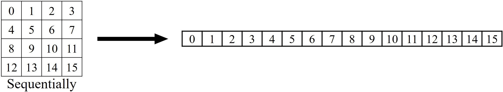
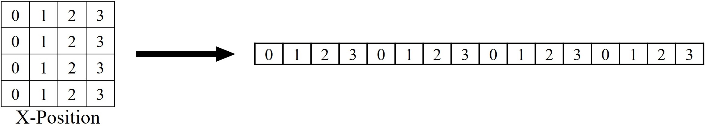
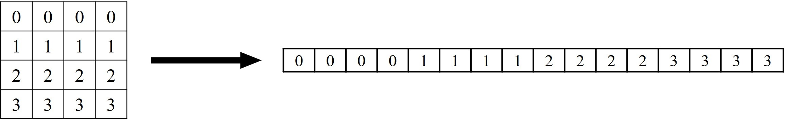
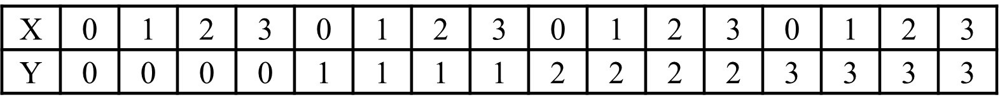

# 2D Positional Encodings for Vision Transformers (ViT)
2D-Positional Encodings Available: <strong>No Position</strong>, <strong>Learnable</strong>, <strong>Sinusoidal (Absolute)</strong>, <strong>Relative</strong>, and <strong>Rotary (RoPe)</strong>.
<ul>
  <li>Works by splitting dimensions into two parts and implements 1D positional encoding on each part.</li>
  <li>One part uses the x-positions sequence, and the other uses y-positions. More details [below](#splitting-X-and-Y-axis-to-Multiple-1D-Positional-Encoding)</li>
  <li>Classification token is handled differently in all methods. More details [below](#handling-classification-token) </li>
  <li>Results on CIFAR10 and CIFAR100 datasets with patch size of 4.</li>
  <li>Network used here in a scaled-down version of the original ViT with only 800k parameters</a>. </li>
</ul>  

I appreciate any feedback on this. 
<br>

## Run commands (also available in <a href="scripts.sh">scripts.sh</a>) <br>

```
python main.py --dataset cifar10 --pos_embed learn
```

Different positional encoding can be applied by changing the <strong>pos_embed</strong> argument. Example:
<table>
  <tr>
    <th>Positional Encoding Type</th>
    <th>Run command</th>
  </tr>
  <tr>
    <td>No Position</td>
    <td>python main.py --dataset cifar10 --pos_embed <strong>none</strong></td>
  </tr>
  <tr>
    <td>Learnable</td>
    <td>python main.py --dataset cifar10 --pos_embed <strong>learn</strong></td>
  </tr>
  <tr>
    <td>Sinusoidal (Absolute)</td>
    <td>python main.py --dataset cifar10 --pos_embed <strong>sinusoidal</strong></td>
  </tr>
  <tr>
    <td>Relative</td>
    <td>python main.py --dataset cifar10 --pos_embed <strong>relative</strong> --max_relative_distance 2</td>
  </tr>
  <tr>
    <td>Rotary (Rope) </td>
    <td>python main.py --dataset cifar10 --pos_embed <strong>rope</strong></td>
  </tr>
</table>
Relative Positional Encoding uses a "max_relative_distance" hyper-parameter to clamp distances between -max_relative_distance and max_relative_distance (referred to as k in the original paper).
<br>
The dataset can be changed using the dataset argument.
<br>
<br>

## Results
Test set accuracy when ViT is trained using different positional Encoding. 
<table>
  <tr>
    <th>Positional Encoding Type</th>
    <th>CIFAR10</th>
    <th>CIFAR100</th>
  </tr>
  <tr>
    <td>No Position</td>
    <td>79.63</td>
    <td>53.25</td>
  </tr>
  <tr>
    <td>Learnable</td>
    <td>86.52</td>
    <td>60.87</td>
  </tr>
  <tr>
    <td>Sinusoidal (Absolute)</td>
    <td>86.09</td>
    <td>59.73</td>
  </tr>
  <tr>
    <td>Relative</td>
    <td><strong>90.57</strong></td>
    <td><strong>65.11</strong></td>
  </tr>
  <tr>
    <td>Rotary (Rope) </td>
    <td>88.49</td>
    <td>62.88</td>
  </tr>
</table>
<br>

## Splitting X and Y-axis to Multiple 1D Positional Encoding
A naive way to apply 1-D positional Encoding is to apply it directly to the sequence generated by flattening the patches, as shown below. However, this does not relate to the 2-D spatial positioning of images.
</img>

To handle this, the encoding dimensions are split into two parts. One part uses the x-axis position sequence, and the other part uses the y-axis position sequence.
2D position is split into two 1D positions: 
</img><br>
</img>
<br>
The x and y-axis sequences are replicated using [get_x_positions](https://github.com/s-chh/2D-Positional-Encoding-Vision-Transformer/blob/ea815c4481508d2439e2cdb4a49f770100515e4b/utils.py#L11) and [get_y_positions](https://github.com/s-chh/2D-Positional-Encoding-Vision-Transformer/blob/ea815c4481508d2439e2cdb4a49f770100515e4b/utils.py#L23) in the <a href="utils.py">utils.py</a> file.
This provides combined 2-D spatial positioning of patches to the Vision Transformer. Example below:
<br>
<br>
</img>
<br>

## Handling Classification Token
Many of the Positional Encoding were designed to work without classification tokens. When a classification token is present, some techniques (Sinusoidal, Relative, and Rotary) must be adapted.
<table>
  <tr>
    <th>Positional Encoding Type</th>
    <th>Classification Token's Positional Encoding</th>
  </tr>
  <tr>
    <td>No Position</td>
    <td>No positional encoding added.</td>
  </tr>
  <tr>
    <td>Learnable</td>
    <td>Classification token learns its positional encoding</td>
  </tr>
  <tr>
    <td>Sinusoidal (Absolute)</td>
    <td>Sinusoidal positional encoding is provided to the patch tokens only, and the classification token learns its positional encoding</td>
  </tr>
  <tr>
    <td>Relative</td>
    <td>Relative positional encoding uses relative distance between tokens to provide positional information. However, the classification token is always the first and should not be considered when calculating relative distances. 
      One solution is not to consider the distances to the classification token. 
      Instead, I used a fixed separate index (0 here) in the encoding lookup tables to represent the distance from all the tokens to the classification token.</td>
  </tr>
  <tr>
    <td>Rotary (Rope) </td>
    <td> X and Y positions start at 1 instead of 0. The 0th index indicates the position of the classification token and results in no change/rotation to the classification token. The rest of the tokens are handled normally.</td>
  </tr>
</table>
<br>

## Parameters Comparison
Comparison of additional parameters added by different positional encoding. 
<table>
  <tr>
    <th>Positional Encoding Type</th>
    <th>Additional Parameters Explaination</th>
    <th>Parameters Count</th>
  </tr>
  <tr>
    <td>No Position</td>
    <td>N/A</td>
    <td>0</td>
  </tr>
  <tr>
    <td>Learnable</td>
    <td>Number of Patches x Embed dim</td>
    <td>64 x 128 = 8192</td>
  </tr>
  <tr>
    <td>Sinusoidal (Absolute)</td>
    <td>No learned parameters</td>
    <td>0</td>
  </tr>
  <tr>
    <td>Relative</td>
    <td> (2 x max_relative_distance + 1 + 1)  x  Embed_dim/(2 x Number_of_attention_heads) x 2 x 2 x Number_of_encoder_blocks
    </td>
    <td> (2 x 2 + 1 + 1) x 128/(2 x 4) x 2 x 2 x 6 = 2304   </td>
  </tr>
  <tr>
    <td>Rotary (Rope) </td>
    <td>No learned parameters</td>
    <td>0</td>
  </tr>
</table>
<br>

## Base Transformer Config
Below are the base training and network details used in the experiments.
<table>
  <tr>
    <td>Input Size</td>
    <td> 3 X 32 X 32  </td>
    <td></td>
    <td></td>
    <td>Epochs</td>
    <td> 200  </td>
  </tr>
  <tr>
    <td>Patch Size</td>
    <td>4</td>
    <td></td>
    <td></td>
    <td>Batch Size</td>
    <td> 128  </td>
  </tr>
  <tr>
    <td>Sequence Length</td>
    <td>8*8 = 64</td>
    <td></td>
    <td></td>
    <td>Optimizer</td>
    <td> AdamW  </td>
  </tr>
  <tr>
    <td>Embedding Dim </td>
    <td>128</td>
    <td></td>
    <td></td>
    <td>Learning Rate</td>
    <td> 5e-4  </td>
  </tr>
  <tr>
    <td>Num of Layers </td>
    <td>6</td>
    <td></td>
    <td></td>
    <td>Weight Decay</td>
    <td> 1e-3  </td>
  </tr>
  <tr>
    <td>Num of Heads </td>
    <td>4</td>
    <td></td>
    <td></td>
    <td>Warmup epochs</td>
    <td> 10 </td>
  </tr>
  <tr>
    <td>Forward Multiplier </td>
    <td>2</td>
    <td></td>
    <td></td>
    <td>Warmup schedule</td>
    <td> Linear  </td>
  </tr>
  <tr>
    <td>Dropout </td>
    <td>0.1</td>
    <td></td>
    <td></td>
    <td>Learning Rate Decay Schedule</td>
    <td> Cosine  </td>
  </tr>
  <tr>
    <td>Parameters </td>
    <td>820k</td>
    <td></td>
    <td></td>
    <td>Minimum Learning Rate</td>
    <td> 1e-5  </td>
  </tr>
</table>
<br>

Note: This repo is built upon the following GitHub repo: <a href="https://github.com/s-chh/PyTorch-Scratch-Vision-Transformer-ViT">Vision Transformers from Scratch in PyTorch</a>

### Citations
```
@article{vaswani2017attention,
  title={Attention is all you need},
  author={Vaswani, Ashish and Shazeer, Noam and Parmar, Niki and Uszkoreit, Jakob and Jones, Llion and Gomez, Aidan N and Kaiser, {\L}ukasz and Polosukhin, Illia},
  journal={Advances in neural information processing systems},
  volume={30},
  year={2017}
}
@inproceedings{dosovitskiy2020image,
  title={An Image is Worth 16x16 Words: Transformers for Image Recognition at Scale},
  author={Dosovitskiy, Alexey and Beyer, Lucas and Kolesnikov, Alexander and Weissenborn, Dirk and Zhai, Xiaohua and Unterthiner, Thomas and Dehghani, Mostafa and Minderer, Matthias and Heigold, Georg and Gelly, Sylvain and others},
  booktitle={International Conference on Learning Representations},
  year={2020}
}
@article{shaw2018self,
  title={Self-attention with relative position representations},
  author={Shaw, Peter and Uszkoreit, Jakob and Vaswani, Ashish},
  journal={arXiv preprint arXiv:1803.02155},
  year={2018}
}
@article{su2024roformer,
  title={Roformer: Enhanced transformer with rotary position embedding},
  author={Su, Jianlin and Ahmed, Murtadha and Lu, Yu and Pan, Shengfeng and Bo, Wen and Liu, Yunfeng},
  journal={Neurocomputing},
  volume={568},
  pages={127063},
  year={2024},
  publisher={Elsevier}
}
```
